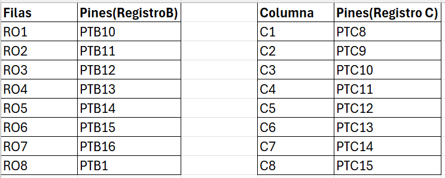
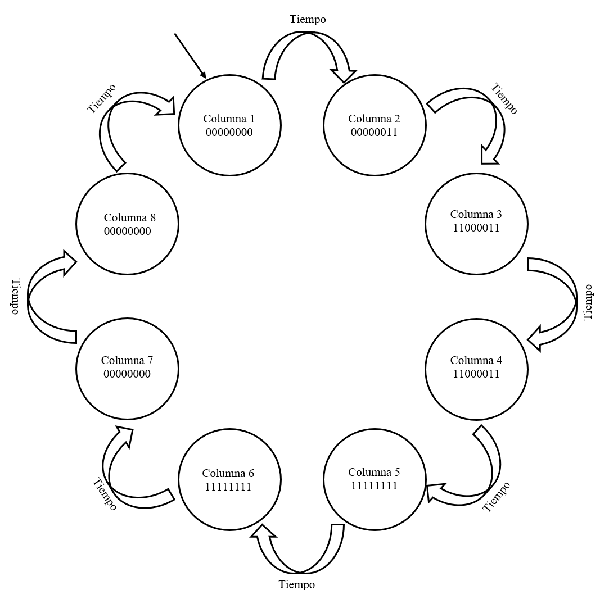

# Unidad 2
## Documentación del Proyecto
 
Nombre del estudiante:  Jose Carlos Herrera 
ID: 000269913

---
# Actividad 1:

## Ejercicio 1:
.syntax unified
.global _start
.text

 .equ DIR_BASE 0x20000800

.thumb_func
_start:
    bl  guardar_datos
    bx  lr

guardar_datos:
    ldr   r4, =#0x20000000
    mov   r0, #50     // Inicializa el primer número a guardar
    mov   r1, #140    // Último número a guardar
loop_guardar:
    str   r0, [r4], #4 // Guarda el número en la memoria y avanza a la siguiente posición
    adds  r0, #10     // Incrementa el número en 100 para el siguiente ciclo
    cmp   r0, r1       // Compara si se ha alcanzado el último número
    ble   loop_guardar // Si no se ha alcanzado el último número, continuar guardando
    bx    lr           // Retorna

## Ejercicio 2:
El código en lenguaje ensamblador ARM muestra un programa sencillo para cargar valores en la memoria y luego copiarlos a otra dirección de memoria. Vamos a analizar cada sección y línea del código:

Inicio y Configuración
assembly
Copiar código
.syntax unified
.global _start
.text
-  	.syntax unified: Especifica que se utilizará la sintaxis unificada de ARM, la cual permite escribir código que pueda ejecutarse en modo ARM o Thumb.
-	.global _start: Define la etiqueta _start como un símbolo global, lo que permite que el linker lo identifique como el punto de entrada.
-	.text: Indica que lo que sigue es una sección de código ejecutable.
Punto de Entrada
.thumb_func
_start:
    bl  init
    bl  cargar_memoria
loop:
    bl  copiar_datos
    b   loop
-	.thumb_func: Indica que la función _start debe ser ejecutada en modo Thumb.
-	_start:: Etiqueta que marca el punto de entrada del programa.
-	bl init: Llama a la subrutina init (Branch with Link).
-	bl cargar_memoria: Llama a la subrutina cargar_memoria.
-	loop:: Etiqueta para un bucle infinito que ejecuta repetidamente la subrutina copiar_datos.
-	b loop: Salta incondicionalmente a la etiqueta loop, creando un bucle infinito.
Subrutina init
init:
    mov   r0, #0
    mov   r1, #0
    mov   r2, #0
    bx    lr
-	init:: Etiqueta que marca el inicio de la subrutina init.
-	mov r0, #0: Mueve el valor 0 al registro r0.
-	mov r1, #0: Mueve el valor 0 al registro r1.
-	mov r2, #0: Mueve el valor 0 al registro r2.
-	bx lr: Retorna de la subrutina (Branch Exchange to Link Register).
Esta subrutina simplemente inicializa los registros r0, r1 y r2 a cero. Aunque parece innecesaria en este contexto porque los valores no se utilizan posteriormente.
Subrutina cargar_memoria
cargar_memoria:
    ldr   r4, =#0x20000000
    mov   r0, #1
    mov   r1, #10
loop_carga:
    str   r0, [r4], #4
    adds  r1, #-1
    beq   fin_carga
    b     loop_carga
fin_carga:
    bx    lr
-	cargar_memoria:: Etiqueta que marca el inicio de la subrutina cargar_memoria.
-	ldr r4, =#0x20000000: Carga la dirección de memoria 0x20000000 en el registro r4.
-	mov r0, #1: Mueve el valor 1 al registro r0.
-	mov r1, #10: Mueve el valor 10 al registro r1, que representa un contador.
-	loop_carga:: Etiqueta para el bucle de carga.
-	str r0, [r4], #4: Almacena el valor de r0 en la dirección apuntada por r4, luego incrementa r4 en 4 bytes.
-	adds r1, #-1: Decrementa r1 en 1 y actualiza las banderas de condición.
-	beq fin_carga: Si r1 es cero, salta a fin_carga.
-	b loop_carga: Salta incondicionalmente a loop_carga si r1 no es cero.
-	fin_carga:: Etiqueta que marca el final del bucle de carga.
-	bx lr: Retorna de la subrutina.
Esta subrutina carga el valor 1 en 10 direcciones de memoria consecutivas, empezando desde 0x20000000.
Subrutina copiar_datos
copiar_datos:
    ldr   r4, =#0x20000000
loop_copia:
    ldr   r0, [r4]
    cmp   r0, #0
    beq   fin_copia
    str   r0, [r4, #0x100]
    add   r4, #4
    b     loop_copia
fin_copia:
    bx    lr
-	copiar_datos:: Etiqueta que marca el inicio de la subrutina copiar_datos.
-	ldr r4, =#0x20000000: Carga la dirección de memoria 0x20000000 en el registro r4.
-	loop_copia:: Etiqueta para el bucle de copia.
-	ldr r0, [r4]: Carga el valor almacenado en la dirección apuntada por r4 al registro r0.
-	cmp r0, #0: Compara el valor de r0 con 0.
-	beq fin_copia: Si r0 es cero, salta a fin_copia.
-	str r0, [r4, #0x100]: Almacena el valor de r0 en la dirección r4 + 0x100.
-	add r4, #4: Incrementa r4 en 4 bytes para apuntar a la siguiente dirección.
-	b loop_copia: Salta incondicionalmente a loop_copia.
-	fin_copia:: Etiqueta que marca el final del bucle de copia.
-	bx lr: Retorna de la subrutina.
Esta subrutina copia los valores almacenados desde 0x20000000 en la dirección 0x20000100 y siguientes, hasta que encuentra un valor 0.
Posibles Mejoras
-	Eliminar la subrutina init: Si no es necesario inicializar los registros r0, r1, r2 con 0 en la práctica, puedes eliminar la subrutina init para simplificar el código.
-	Combinar cargar_memoria y copiar_datos: Podrías optimizar combinando las dos subrutinas en una sola, si no es necesario tenerlas separadas. Esto reduciría la complejidad y el número de instrucciones.
-	Reducir las instrucciones de carga de la dirección: En lugar de cargar la dirección 0x20000000 varias veces, podrías hacerlo una sola vez y pasarla como argumento a las subrutinas.

## Ejercicio 3:

.syntax unified
.global _start
.text

.thumb_func
_start:
    bl  crear_tabla_leds
    bx  lr

crear_tabla_leds:
    ldr   r4, =#0x20000000 // Dirección inicial de memoria para guardar la tabla
    ldr   r1, =leds        // Dirección de la tabla en la memoria de programa
    mov   r2, #8           // Tamaño de la matriz (filas)
    mov   r3, #8           // Tamaño de la matriz (columnas)
loop_filas:
    ldrb  r0, [r1], #1     // Carga el byte actual de la tabla de LED
    strb  r0, [r4], #1     // Guarda el byte en la dirección de memoria y avanza
    subs  r3, r3, #1       // Decrementa el contador de columnas
    bne   loop_filas       // Continúa el bucle si no se han procesado todas las columnas
    mov   r3, #8           // Reinicia el contador de columnas para la siguiente fila
    subs  r2, r2, #1       // Decrementa el contador de filas
    bne   loop_filas       // Continúa el bucle si no se han procesado todas las filas
    bx    lr               // Retorna

.section .rodata
leds:
    .byte 0b11111111 // Representación de la primera fila de LEDs
    .byte 0b11111111 // Representación de la segunda fila de LEDs
    .byte 0b00011000 // Representación de la tercera fila de LEDs
    .byte 0b00011000 // Representación de la cuarta fila de LEDs
    .byte 0b00011000 // Representación de la quinta fila de LEDs
    .byte 0b00011000 // Representación de la sexta fila de LEDs
    .byte 0b11111000 // Representación de la séptima fila de LEDs
    .byte 0b11111000 // Representación de la octava fila de LEDs

## Ejercicio 4:

1. “.equ v1, 0x20000100”: Define una constante v1 que representa la dirección de memoria 0x20000100, donde se almacenará el primer vector.
2. “.equ v2, 0x20000140”: Define una constante v2 para la dirección 0x20000140, donde se almacenará el segundo vector.
3.  “.equ vRes, 0x20000200”: Define una constante vRes para la dirección 0x20000200, donde se almacenará el resultado de la multiplicación de los vectores.
4. lista1 y lista2: Son etiquetas que marcan el inicio de dos listas de enteros de 16 bits (.hword), terminadas con un 0 que se usará como indicador de final de la lista.
5.  “_start”: Es la función principal donde comienza la ejecución del programa.
6.  “bl init”: Llama a la función init, que en este caso no realiza ninguna acción útil.
7.  “bl vector1”: Llama a la función vector1, que carga el contenido de lista1 en la memoria a partir de v1.
8.  “bl vector2”: Llama a la función vector2, que carga el contenido de lista2 en la memoria a partir de v2.
9.  “loop”: Marca el inicio de un bucle infinito.
10.  “bl mult_vect”: Llama a la función mult_vect, que multiplica los elementos correspondientes de los vectores v1 y v2, y almacena el resultado en vRes.
11.  “b loop”: Bucle infinito que asegura que la función de multiplicación se ejecuta repetidamente.
12. “init”: No realiza ninguna acción, solo retorna al llamador con bx lr.
13.  vector1 y vector2: Estas funciones cargan la dirección de inicio de lista1 y lista2 en el registro r4, respectivamente, y la dirección de memoria donde se guardará el contenido (v1 o v2) en r5.
14.  “push {lr}”: Guarda el registro de enlace (lr) en la pila para preservar la dirección de retorno.
15.  “ldr r4, =#lista1”: Carga la dirección de lista1 en el registro r4 (para vector2, sería lista2).
16.  “ldr r5, =#v1”: Carga la dirección de v1 en el registro r5 (para vector2, sería v2).
17.  “bl loop_store”: Llama a la función loop_store que copia los elementos de la lista en la memoria.
18.  “pop {pc}”: Restaura el registro de enlace y retorna al llamador.
19.  “loop_store”: Esta función carga cada elemento de lista1 o lista2 en el registro r0 y los guarda en la dirección de memoria correspondiente.
20.  “ldrh r0, [r4], #2”: Carga un dato de 16 bits (half-word) desde la dirección apuntada por r4 en r0, luego incrementa r4 en 2.
21.  “cmp r0, #0”: Compara el valor en r0 con 0.
22.  “beq end_store”: Si r0 es 0, salta a end_store, terminando la copia.
23.  “strh r0, [r5], #2”: Almacena el valor en r0 en la dirección apuntada por r5, luego incrementa r5 en 2.
24.  “b loop_store”: Repite el ciclo hasta encontrar el 0.
25.  “mult_vect”: Carga las direcciones de v1, v2, y vRes en r4, r5, y r6 respectivamente.
26.  “b loop_mult”: Salta al inicio del bucle de multiplicación.
27.  “loop_mult”: Multiplica los elementos de los vectores v1 y v2 y almacena los resultados en vRes.
28.  “ldrh r0, [r4], #2 y ldrh r1, [r5], #2”: Carga los elementos correspondientes de v1 y v2.
29.  cmp r0, #0 y cmp r1, #0: Compara los valores de r0 y r1 con 0.
30.  mul r0, r1: Multiplica los valores en r0 y r1 y guarda el resultado en r0.
31.  str r0, [r6], #4: Almacena el resultado en la dirección apuntada por r6 y luego incrementa r6 en 4.
32.  “b loop_mult”: Repite el ciclo de multiplicación hasta que encuentre un 0 en alguno de los vectores.
## Ejercicio 5 y 6:
Para este ejercicio el codigo y funcionamiento fue utilizado como esqueleto para la creacion de la matriz de leds, puedes vericarlo en la capeta llamada "Matriz" lo cual es una combinacion  del codigo de semaforo y el codigo de prender un led de la matriz solo que mas complejo y prediendo todos los leds.
# Actividad 2:
La actividad del semaforo esta agregada como carpeta al repositorio con el nombre de "Semaforo".

# Actividad matriz de leds:
La actividad de la matriz de leds esta agregada como carperta al repositorio con el nombre de "Matriz".
## Maquina de estados:

## Pines:

 

